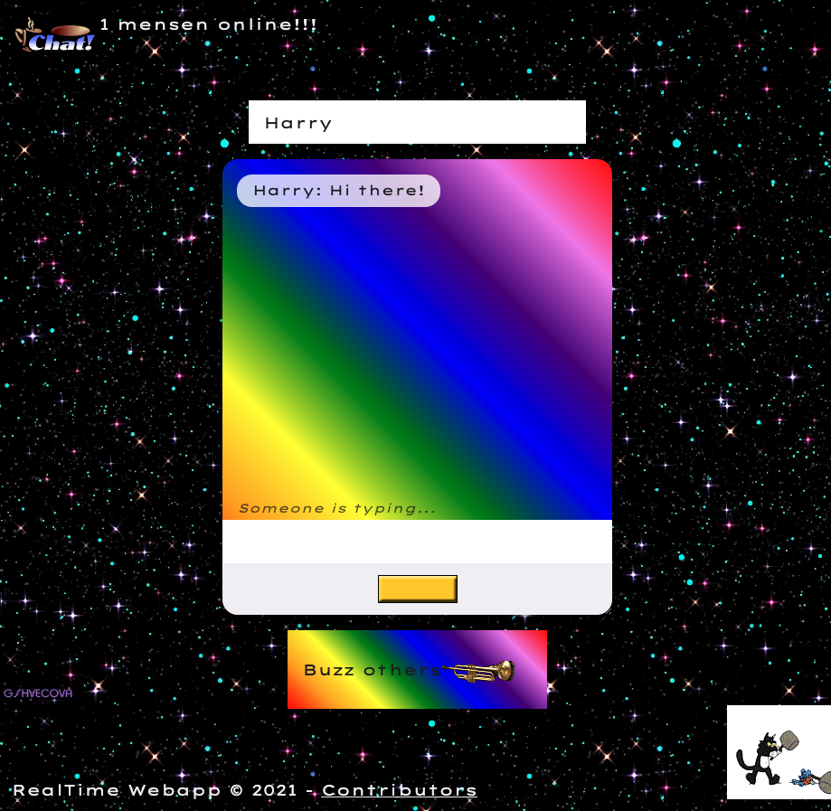

###### RealTime Webapp, Minor Web Design & Development
# Assignment 1 - Chat app
###### Contributors
[Jochem](https://github.com/jochemvogel), [Niels](https://github.com/NielsPeeters96), [Shabier](https://github.com/sjagoori), [Sjors](https://github.com/SjorsWijsman), [Thom](https://github.com/thomvessies), [Ralf](https://github.com/ralfz123) and [Sjoerd](https://github.com/shreen020)



## Concept

This application is an app where you can chat with each other. The app is built with [socket.io](https://socket.io/), [NodeJS](https://nodejs.org/en/) and [Express](https://expressjs.com/). The User Interface has a super user-friendly modern interface .. or not? :stuck_out_tongue_winking_eye:

### Features
- [x] Register an user / login with name
- [x] Type a message and display it in the app
- [x] When user is typing, he sees "_Someone is typing_"
- [x] The user status is display by an amount of online users
- [x] Notifications by sound
- [ ] (Bonus) List of all online users (with profile picture)

## Code consistency

This project uses Prettier for managing the code consistency

###### .prettierrc

```json
{
  "singleQuote": true
}
```